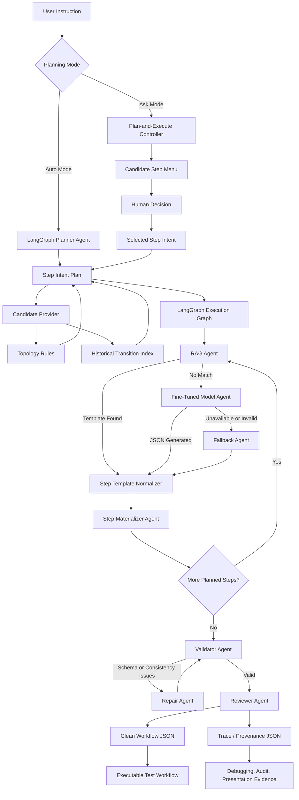
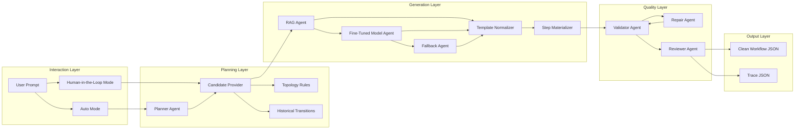

# Latest GIS Code AI Architecture

## High-Level Flow



## Layered View



## Why These Layers Were Added

### 1. Interaction Layer

The system now supports two planning modes:

- **Auto Mode**: the system plans and executes the workflow automatically.
- **Human-in-the-Loop Mode**: the system pauses at decision points and asks the user to choose the next step.

This is useful because GIS workflows often contain ambiguous transitions. For example, after creating an object, the next action could be update, delete, open, run a check, click a button, or continue with a physical child object.

### 2. Planning Layer

The planning layer separates **what should happen next** from **how the JSON should be generated**.

Candidate steps come from:

- **Topology rules**: domain logic such as installation -> rail -> field.
- **Historical transitions**: real workflow sequences mined from previous test data.

This makes the system more explainable than pure LLM generation because each recommendation has a source and, when available, historical examples.

### 3. Generation Layer

The generation layer uses a fallback chain:

1. **RAG Agent** retrieves a real historical JSON template when a matching step exists.
2. **Fine-Tuned Model Agent** generates a step when RAG cannot find a suitable template.
3. **Fallback Agent** creates a deterministic schema-safe step when both retrieval and model generation are unavailable.

This design keeps the strengths of the original single-step RAG demo, while adding the fine-tuned model as the missing fallback path.

### 4. LangGraph Execution Layer

LangGraph is used to make the multi-agent workflow explicit:

```text
plan -> rag -> fine_tuned_model -> fallback -> materialize -> validate -> repair -> review
```

Instead of hiding the logic inside one large function, each step is represented as a graph node. This makes the architecture easier to debug, extend, and present.

### 5. Quality Layer

The validator, repairer, and reviewer were added because model-generated JSON can be incomplete or noisy.

The quality layer checks:

- required fields
- valid methods
- step index consistency
- object ID consistency
- whether the final workflow is ready to export

This prevents raw model output from being treated as executable workflow JSON too early.

### 6. Output Layer

The final output is split into two files:

- **Clean Workflow JSON**: only executable workflow fields, matching the original data format.
- **Trace JSON**: internal evidence such as selected candidates, agent traces, RAG/model/fallback source, and validation results.

This separation is important because the final JSON should not contain internal decision fields, but the project still needs traceability for debugging and presentation.

## Suggested Presentation Summary

The latest architecture changes the project from a single-step generator into a controllable multi-agent workflow system.

The key improvement is separation of responsibilities:

- planning decides the next possible steps
- RAG retrieves historical templates
- the fine-tuned model fills gaps when RAG has no answer
- fallback logic guarantees a runnable structure
- LangGraph coordinates the agents
- validation and repair improve reliability
- clean output and trace output separate execution from explanation

This makes the system more robust, explainable, and closer to a practical local deployment workflow.
